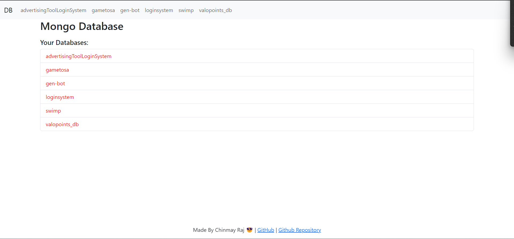

# Mongo DB Client

View Databases, Collections and Data stored.

## Run Locally

Clone the project

```bash
  git clone https://github.com/chinmayraj28/mongo-db-client.git
```

Go to the backend project directory

```bash
  cd your-project-name
```

Install dependencies

```bash
  npm install
```

Start the server

```bash
  npm run start
```

This will turn the server on. Running on local host port 3000. You can also change this in the source code.

## Demo Images





## Authors

- [@chinmayraj28](https://github.com/chinmayraj28)
